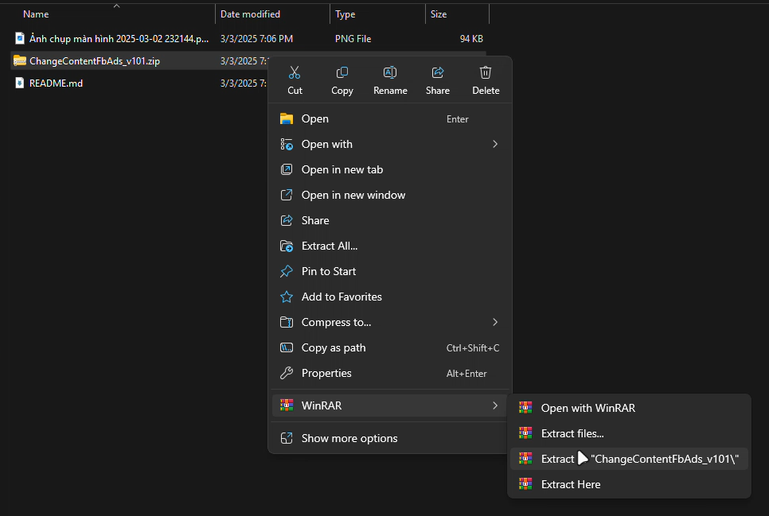
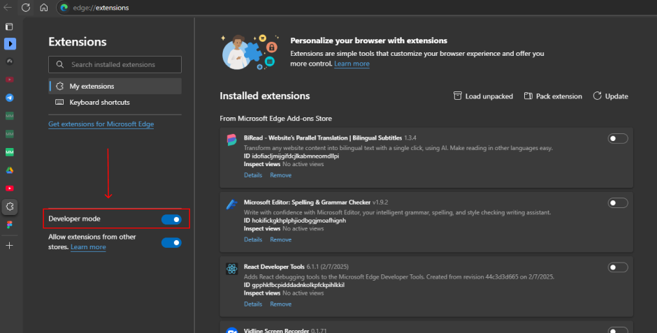
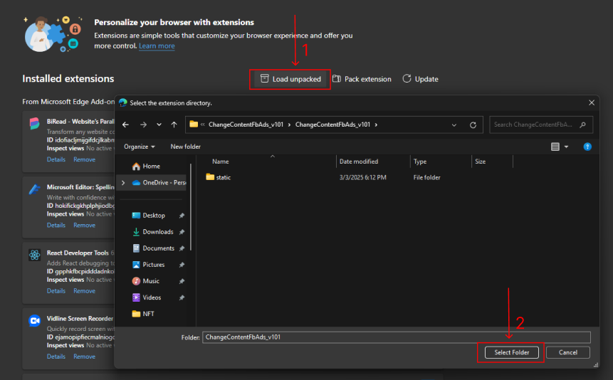
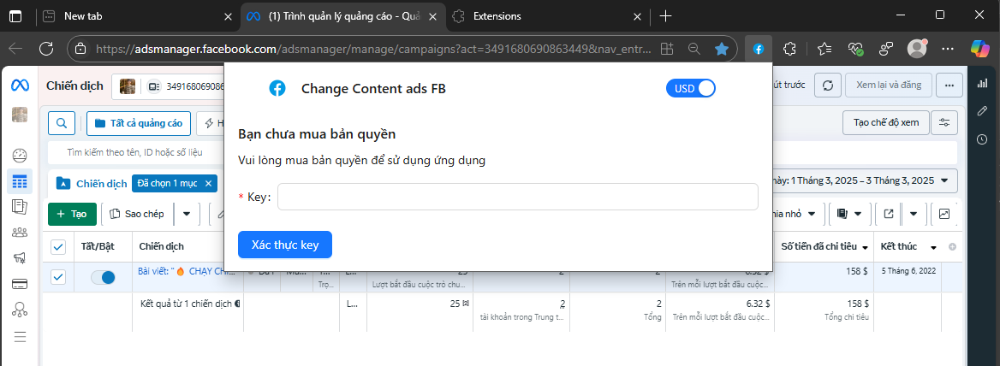
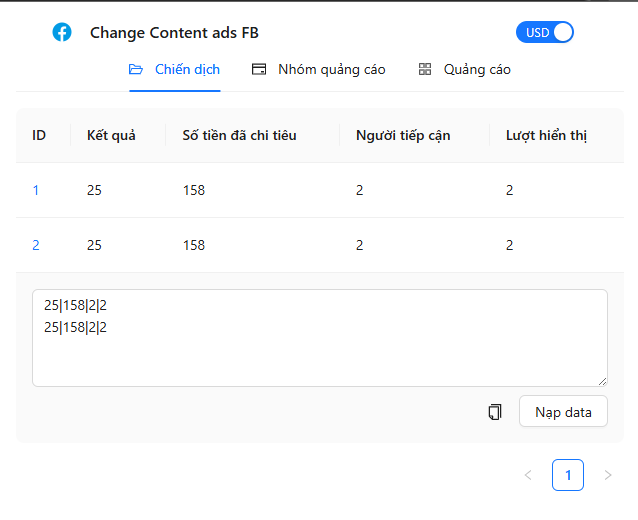

## Công cụ Fake Số Liệu Ngân Sách Cho Facebook Ads


-   💰 Fake số tiền mỗi kết quả và số kết quả theo đúng mong muốn của bạn.
-   🔄 Dữ liệu vẫn giữ nguyên ngay cả khi F5 / reload, chỉ trở về mặc định khi tắt extension.
-   🔒 Hoàn toàn an toàn, đây là một extension chạy ngay trên trình duyệt của bạn, không tương tác được với máy cá nhân.
-   🛡️ Bảo hành vĩnh viễn, cập nhật miễn phí trọn đời.
-   🎁 Cho phép dùng thử miễn phí trong 3 ngày.

## Mua hàng tại: [taphoammo.net](https://taphoammo.net/gian-hang/cong-cu-fake-so-lieu-ngan-sach-cho-facebook-ads_5432471)

> Hoặc liên hệ qua Telegram: [@dinhvan2310](https://t.me/dinhvan2310)

## Hướng Dẫn Cài Đặt

1.  **Tải extension tại [đây](ChangeContentFbAds_v101.zip)**

2.  **Giải nén file vừa tải về**

    

3.  **Mở trình duyệt Chrome, truy cập vào `chrome://extensions/`**

    > Hoặc `edge://extensions/` nếu bạn đang sử dụng trình duyệt Edge

4.  **Bật chế độ `Developer mode`** 

    

5.  **Chọn `Load unpacked` và chọn thư mục vừa giải nén ở bước 2, sau đó chọn `Select Folder`**

    

6.  **Mở Extension và nhập key để sử dụng**

    

## Hướng Dẫn Sử Dụng

**Nhập data vào các tab tương ứng [Campaign, Adset, Ad] theo cấu trúc sau:**

`Kết quả|Số tiền đã chi tiêu|Người tiếp cận|Lượt hiển thị`



Mỗi dòng dữ liệu tương ứng với một hàng trong bảng dữ liệu trên Facebook Ads. Dòng cuối cùng luôn đại diện cho dòng tổng kết của bảng.

Có thể để trống một dòng nếu không muốn fake dữ liệu cho dòng đó.

**Ví dụ:**

```text
100|100000|1000|10000 

200|200000|2000|20000
300|300000|3000|30000
```

<video controls src="assets/20250303-1245-13.6918372.mp4" title="Title"></video>

